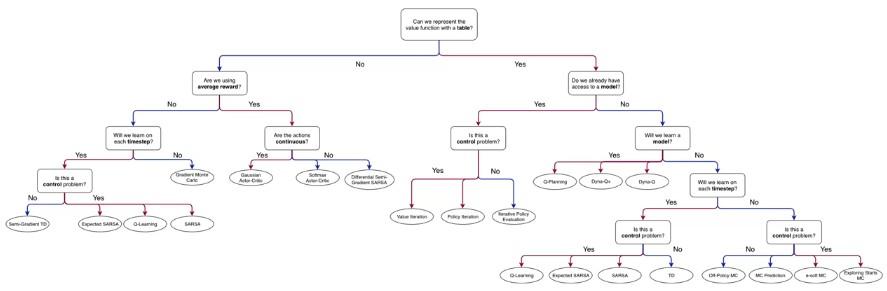
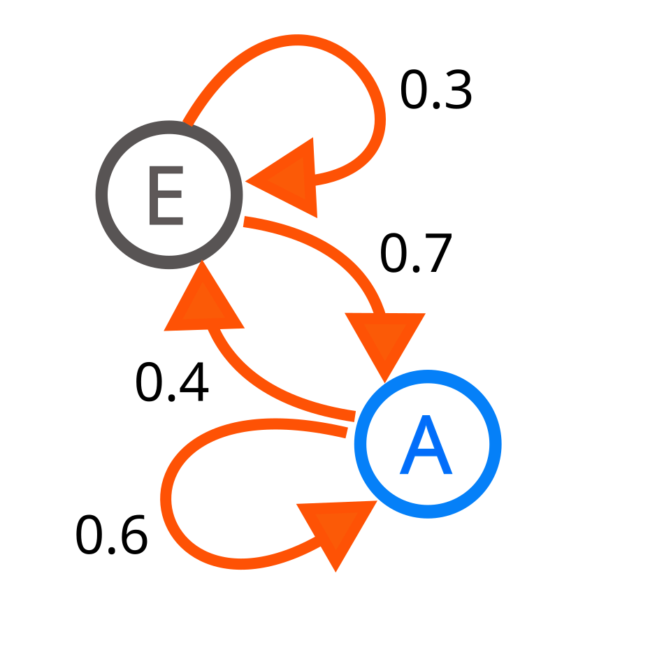
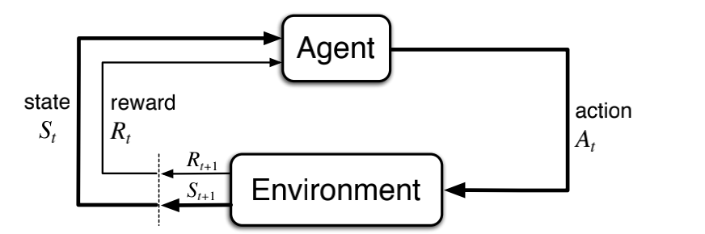
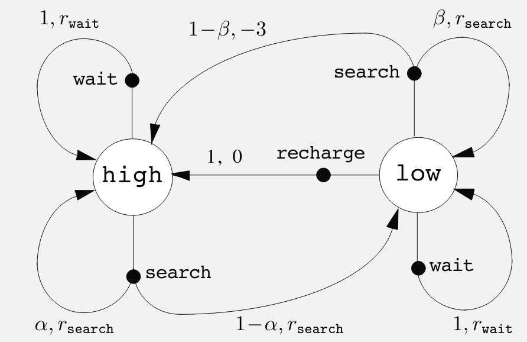

{.column-margin .nolightbox} 

{.column-margin group="slides"}

# Lesson 1: Introduction to Markov Decision Processes

::: {.callout-tip collapse="true"}
### Readings {.unnumbered}

-   [x] [@sutton2018reinforcement§3.3, pp. 47-56] [book](http://incompleteideas.net/book/RLbook2020.pdf#page=47)
:::

::: {.callout-note}
### Learning Objectives {.unnumbered}

-   [x] Understand Markov Decision Processes (MDP). [\#](#l1g1)
-   [x] Describe how the dynamics of an MDP are defined. [\#](#l1g2)
-   [x] Understand the graphical representation of a Markov Decision Process. [\#](#l1g3)
-   [x] Explain how many diverse processes can be written in terms of the MDP framework. [\#](#l1g4)
:::

::: {#vid-silver-2015 .column-margin}


In [@silver2015] Silver covers The Markov Property, Markov Processes, Markov Reward Processes, etc.
:::

Before I started this course I viewed [@silver2015] online course by David Silver who in many ways is the face of RL. He is also the lead of the AlphaGo project, a principal researcher at DeepMind and a lecturer at University College London. Silver is also featured in one of the Lectures in this specialization. In his course he develops the MDP constructively starting with simpler structures as is often done in mathematics. I find this is a good way to learn how to think about how we generalize and specialize from more abstract to more concrete structures.

 What I like about Silver's presentation is that he uses a constructive approach to construct an MDP much like other mathematical structures are introduced .e.g. field in an Algebra course is introduced by first defining a group, then a ring, and then a field which allows us to see how the different structures are related and how they build on each other. This approach is particularly helpful when many of the students are already familiar with the simpler structures. In this case since Markov chains are so ubiquitous in many fields, most students will already be familiar with them, so starting with Markov chains and then building up to MDPs seems better than just starting with MDPs. Also it makes it easier to introduce an important extension to MDPs, such are POMDPs which is what Silver does in his course and in the notes.

In [@silver2015] Silver begins with a **Markov Process**, with states and transitions probabilities, by adding **rewards** he constructs a *Markov reward process*. Then by adding **actions** he constructs a *Markov decision process*. He explains these and in the notes covers three additional extensions. In the the notes he also add the following MDP extensions:

-   Infinite and continuous MDPs - the case of optimal control
-   Partially observable MDPs.
-   Undiscounted, average reward MDPs.
-   David Silver's 2015 [UCL Course](https://www.davidsilver.uk/teaching/) [Video](https://www.youtube.com/watch?v=2pWv7GOvuf0) and Slides.

## Markov Process {#sec-Markov-Process}

{.column-margin group="slides"}

Silver goes into some detail on what we mean by state in RL:

-   In th abstract state can be any function of the history.
-   The state should summarize the information on the previous actions, and rewards.
-   He points out that the [history in RL can be very long, for Atari games it can include actions plus all the pixels for every screen in many plays of the game. In contrast the state tries to capture the bare essentials of the history for decision making at each time step]{.mark}. For Atari games they used the last 4 screens as the state.
-   A second point is that there is always a state. The full history is also a state, but not a very useful one. The internal representation of the ram in the Atari game is also a state, much smaller but this is the representation used by the environment and contains more information than is available to the agent. Ideally the agent would want to model this state, but again it contains lots more information than is available would need to male a decision.
-   Another useful property of the state is that it should have the Markov Property for a state space which is when the future is independent of the past given the present.

A state $S_t$ is Markov if and only if:

$$ 
\mathbb{P}[S_{t+1}  \vert  S_{t}] =  \mathbb{P}[S_{t+1}  \vert  S_1,...,S_t] \qquad \text{(Markov Property)}
$$ {#eq-markov-property}

**The state captures all relevant information from the history** Once the state is known, the history may be thrown away i.e. [The state is a sufficient statistic of the future]{.mark}

Recall:

> a statistic satisfies the criterion for sufficiency when no other statistic that can be calculated from the same [sample](https://en.wikipedia.org/wiki/Sample_(statistics) "Sample (statistics)") provides any additional information as to the value of the parameter". — [@doi:10.1098/rsta.1922.0009]

For a Markov state $s$ and successor state $s'$, the state transition probability is defined by:

$$
\mathbb{P}_{ss'} = \mathbb{P}[S_{t+1}=s'  \vert  S_t=s]
$$

::: {#def-Markov-Process}
## Markov Process AKA Chain  

A Markov Process is a tuple $⟨S,P⟩$ where:

- $S$ is a (finite) set of states
- $P$ is a state transition probability matrix, 
  $P_{ss'} = P[S_{t+1} = s'  \vert S_t=s]$ State transition matrix $P_{ss'}$ defines transition probabilities from all states $s$ to all successor states $s'$,

$$
\begin{aligned}
  P=\left( \begin{array}{cc}
      p_{11} & \cdots & p_{1n} \\ 
      \vdots & \ddots & \vdots \\ 
      p_{n1} & \cdots & p_{nn} \end{array} \right)
\end{aligned}
$$ {#eq-transition-matrix}

:::   
<!-- #def-Markov-Process -->

A [Markov process]() AKA [Markov chain](https://en.wikipedia.org/wiki/Markov_chain), are well studied in probability theory and have many applications in physics, chemistry, economics, and many other fields. They are used to simplify the analysis of complex systems by modeling them as a sequence of states with probabilistic transitions but without a long term memory. I.e. in the Markov process the future is independent of the past given the present. Another way of saying this is that the once the current state is known, the history of how we got to that state is irrelevant for predicting the future.  This is the idea of a sufficient statistic. The state is a sufficient statistic of the future.

While this may seem like a strong assumption, it is possible to bundle up into the current state all the relevant information from the history that we need to make decisions about the future.

For example in Atari games the current state uses the last 4 screens, which allows us to overcome the static nature of a single screen and represent the velocity of objects in the game, which is important for making decisions about the future. However it is up to the algorithm to figure out which pixels are part of the same object in the different screens etc. 

While the Markov process captures the dynamics of the environment, using the $P$ matrix, it lacks the notion of rewards and actions. 

## Markov Reward Process {#sec-MRP}

A Markov Reward Process **(MRP)** is a Markov chain with values.

::: {#def-MRP}
## Markov Reward Process (MRP)

A Markov Reward Process is a tuple $⟨S, P, R, \gamma⟩$ with:

-   $S$ is a finite set of states
-   $P$ is a state transition probability matrix.
-   $R$ is a reward function, $R_s = \mathbb{E}[R_{t+1} \vert S_t = s]$
-   $\gamma$ is a discount factor, $\gamma \in [0, 1]$
:::

Note that the first two parts of the tuple are just a *Markov process*. 
The reward function $R$ assigns a reward to each state. 
The discount factor $\gamma$ is a little less obvious - it determines how much the agent cares about future rewards if that's a bit abstract, perhaps think of it as the strength of the lens through which the agent views the future. 

A discount factor of 0 means that the agent only cares about immediate rewards, while a factor of 1 means that it cares about future rewards just as much as immediate rewards. Now let's make this more precise by defining the return and the value function.

::: {#def-return}
### The return  $G_t$

is the total discounted reward from time-step t.

$$
G_t =R_{t+1}+\gamma R_{t+2}+...=\sum_{k=0}^{\infty} \gamma^k R_{t+k+1} 
$$ {#eq-return}

- where:
  -   $R_t$ is the reward at time-step $t$
  -   $\gamma$ the discount factor $\gamma \in [0, 1]$ is the present value of future rewards.
  -   The value of receiving reward $R$ after $k+1$ time-steps is $\gamma^k R$
  -   This values immediate reward above delayed reward.
      -   $\gamma = 0$ makes the agent short-sighted.
      -   $\gamma = 1$ makes the agent far-sighted.
:::

The return $G_t$ is a random variable because both the rewards and the transitions can be stochastic. The return is the total discounted reward from time-step $t$.

:::  {#def-value}
### The value function

The value function:

:   The state value function $v(s)$ of an MRP is the expected return starting from state $s$

$$
v(s) =\mathbb{E} [G_t  \vert  S_t = s]
$$
:::

### Bellman equations for MRP {#sec-bellman-MRP}

The value function can be decomposed into two parts:

-   an immediate reward $R_{t+1}$ and
-   a discounted value of successor state $\gamma v(S_{t+1})$

The Bellman equation for MRPs expresses this relationship:

$$
\begin{aligned} 
v(s) &= \mathbb{E}[G_t  \vert  S_t=s] \\ 
& = \mathbb{E}[R_{t+1} + \gamma R_{t+2}+\gamma^2 R_{t+3} + ...  \vert S_t = s]   \\ 
& = \mathbb{E}[R_{t+1} + \gamma( R_{t+2}+\gamma^2 R_{t+3} + ... )  \vert S_t = s]   \\ 
& = \mathbb{E}[R_{t+1} + \gamma G_{t+1}  \vert  S_t = s]   \\ 
& = \mathbb{E}[R_{t+1} + \gamma v(S_{t+1})  \vert S_t = s] 
\end{aligned} \qquad \text{(Bellman Equation)}
$$ {#eq-bellman-mrp}

The Bellman equation can also be expressed in terms of the dynamics matrix for state transitions:

$$
v(s) = R_s + γ \sum_{s'\in S} P_{ss'}v(s) \qquad \text{value with dynamics}
$$ {#eq-bellman-mrp-with-dynamics-matrix}

where we use the dynamics matrix $P$ to express the expected value of the successor state.

## Markov Decision Processes {#sec-MDP}

-   The k-Armed Bandit problem does not account for the fact that different situations call for different actions.
-   Because it the problem is limited to a single state agents can only make decisions based on immediate reward so they fail to consider the long-term impact of their decisions - this is an inability to make plan.

{.column-margin group="slides"}

::: {#def-MDP}
### MDP definition 

A Markov Decision Process is a Markov Reward Process with decisions i.e. a tuple $⟨S, A, P, R, \gamma⟩$

- where:
  -   $S$ is a finite set of states
  -   $A$ is a finite set of actions
  -   $P$ is a state transition probability matrix, $P_{ss'}^a = \mathbb{P}[S_{t+1} = s' \vert S_t = s, A_t = a]$
  -   $R$ is a reward function, $R_s^a = \mathbb{E}[R_{t+1} \vert S_t = s, A_t = a]$
  -   $\gamma$ is a discount factor, $\gamma \in [0, 1]$
:::

### The dynamics of an MDP {#sec-MDP-dynamics}

In a finite MDP, the sets of states, actions, and rewards (S, A and R) all have a finite number of elements. In this case, the random variables $S_t$ and $R_t$ have well defined discrete probability distributions dependent only on the preceding state and action.

The dynamics of an MDP are defined by the four argument dynamics function:

$$
p(s',r \vert s,a)\ \dot =\ Pr\{S_t = s', R_t = r \vert S_{t-1} = s, A_{t-1} = a\}\qquad  \forall s',s \in S\ \forall r\in R\ \forall a\in A
$$ {#eq-four-part-dynamics}

where the sum of the probabilities over fixed set of s,a is 1:

$$
\sum_{s' \in S} \sum_{r \in R} p(s',r \vert s,a) = 1 \qquad \forall s \in S, \forall a \in A \qquad \text{(Dynamics function)}
$$ {#eq-dynamics-function-sum}

This is just a regular function that takes a state and action and returns a probability distribution over the next state and reward.

In a tabular setting, we can also express this function as a table. Here is my solution for ex 3.4, a table for the recycling robot

| $s$  | $a$      | $s'$ | $r$          | $p(s',r \mid s,a)$ |
|------|----------|------|--------------|--------------------|
| high | search   | high | $r_{search}$ | $\alpha$           |
| high | search   | low  | $r_{search}$ | $1-\alpha$         |
| low  | search   | high | -3           | $1-\beta$          |
| low  | search   | low  | $r_{search}$ | $\beta$            |
| high | wait     | high | $r_{wait}$   | 1                  |
| low  | wait     | low  | $r_{wait}$   | 1                  |
| low  | recharge | high | 0            | 1                  |

: Dynamics function for a recycling robot MDP {#tbl-dynamics-function}

a couple of takeaways from this exercise are:

1.  Rewards are uniquely assigned for action at $s$ resulting in $s'$ so we don't need to make $r$ another factor i.e. list all possible rewards for $(s,a,s')$ tuple.

2.  there are $(s,a,s',r)$ tuples for which we don't have a non-zero probabilities - since there are no transition possible.

e.g. the robot wont charge when high, so there isn't a transition from that state, nor a reward, nor a probability.

### Graphical representation of an MDP {#sec-MDP-graphical}

The graphical representation of an MDP is a directed graph where the nodes represent states and the edges represent actions. The graph is labeled with the probabilities of transitioning from one state to another given an action.

{#fig-mdp-graph .column-margin group="slides"}

In an MDP, the probabilities given by four part dynamics function completely characterize the environment’s dynamics.

That is, the probability of each possible value for $S_{t+1}$ and $R_{t+1}$ depends only on the immediately preceding state $S_t$ and action $A_t$.

This is best viewed a restriction not on the decision process, but on the state.

The state must include information about all aspects of the past agent–environment interaction that make a difference for the future.

If it does, then the state is said to have the Markov property.

We can use the four-part dynamics function to compute the **state transition probabilities** for a given state and action:

$$
\begin{align}
  p(s' \vert s,a) &= \mathbb{P}[S_t = s'\vert S_{t-1} = s, A_{t-1} = a] \\ 
  &= \sum_{r \in R} p(s',r \vert s,a) \qquad \text{(state transition p)}
\end{align}
$$ {#eq-transition-probabilities}

where we summed over all possible rewards to get the state transition probability.

We can use the four-part dynamics function to compute the **expected rewards** for a given state and action:

$$
\begin{align}
  r(s,a) &= \mathbb{E}[R_t \vert S_{t-1} = s, A_{t-1} = a] \\ 
  &= \sum_{r \in R} r  \times \sum_{s' \in S}  p(s', r, \vert s, a) 
\end{align}
$$ {#eq-expected-reward-for-state-action}

where we summed over all possible rewards and all successor state to get the expected reward.

We can also get the expected reward for a given state, action, and successor state using the four-part dynamics function:

$$
\begin{align}
  r(s,a,s') &= \mathbb{E}[R_t \vert S_{t-1} = s, A_{t-1} = a, S_t = s'] \\ 
  &= \sum_{r \in R} r \times 
  \frac {  p(s', r \vert s, a) } {  p(s' \vert s, a) } 
\end{align}
$$ {#eq-expected-reward-for-state-action-successor-state}

where we summed over all possible rewards to get the expected reward.

Note: perhaps implementing these in python might be further clarify the math for a given state transition graph.

# Lesson 2: Goal of Reinforcement Learning

::: {.callout-note}
### Learning Objectives {.unnumbered}

-   [x] Describe how rewards relate to the goal of an agent. [\#](#l2g1)
-   [x] Understand episodes and identify episodic tasks. [\#](#l2g2)
:::

## Rewards and the Goal of an Agent {#l2g1}

The agent interacts with the environment by taking actions and receiving rewards.

In the bandit setting, it is enough to maximize immediate rewards. In the MDP setting, the agent must consider the long-term consequences of its actions.

return $G_t$ is the total future reward from time-step $t$.

$$
G_t \dot= R_{t+1} + R_{t+2} +  R_{t+3} + \ldots 
$$ 

- $G_t$ is a random variable because both transition and the rewards can be stochastic.

The goal of an agent is to maximize the expected cumulative reward.

::: {.callout-note}
### The reward hypothesis {#def-reward-hypothesis}

That all of what we mean by goals and purposes can be well thought of as the maximization of the expected value of the cumulative sum of a received scalar signal (called reward).

see [@SILVER2021103535]
:::

some basic formulations of the goal of an agent:

1.  **Maze runner**: -1 for each time step until the goal is reached, then 0.
2.  **Recycling robot**: +1 per can, 0 otherwise.
3.  **Chess**: 1 for a win, 0 for a draw, -1 for a loss.

My insight about reward formulation based on real world experience from working in advertising is that the when the reward is sparse and delayed in chess the credit assignment problem is more difficult than from cases where rewards are proximal and more frequent.

In web analytics for advertising data scientist come up with different attribution model in which they try to assign credit for a conversion to different touch points in the customer journey and more importantly to specific interaction with advertisements. There is however advertising that is not captured e.g. offline advertising. And even if one had an accurate record of all the adverts a customer was exposed can anyone really assign credit to which specific interactions resulted in a purchase? This is clearly a situation where all models are false but some are useful.

If we get to choose or better yet engineer the reward function than we should strive to make the make credit assignment as easy as possible for the agent. This should then help the rest of the algorithmic machinery to learn faster and more efficiently since the RL problem is all about propagating local rewards to a global value function or policy. Learning value function might not complete very quickly but the optimal policy might be learned much faster if the reward function lets the value function stabilize faster.

## Episodes and Episodic Tasks {#l2g2}

::: {#def-episode}
## An episode 
is a sequence of states, actions, and rewards that ends in a terminal state. 
:::

::: {#def-episodic-task}
An episodic task is a task with a well-defined terminal state.
:::

::: {#exm-episodic-task}
## Chess is an episodic task
An example of an episodic task is a game of chess, where the game ends when one player wins or the game is a draw. Then the agents gets a reward of +1 for a win, 0 for a draw, and -1 for a loss. The episode ends when the game is over. But the agents can play many games of chess. However rewards for one game of chess are not affected by the rewards for other games of chess. Each game is an episode and the rewards for one episode do not affect the rewards for another episode.

One interesting point about chess is that the rewards is sparse and delayed. If we wanted our agent to learn to play faster we might be able to help it out by providing intermediate rewards and penalties 
  - material advantage 
  - positional advantage like 
      - controlling the center, 
      - controlling diagonals, open ranks or files,
      - passed pawns,
      - occupying outposts with knights,
  - positional disadvantage like
      - doubled pawns
      - isolated pawns
  - moving pieces twice in the opening
  - castling early
  - having like hanging pieces 
  
As we add more intermediate rewards we make the credit assignment problem easier for the agent and it should be able to learn faster. 
  
However, we need to be careful not to add too many rewards or we might end up with a reward function that is too complex and hard to optimize. We also need to be careful not to add rewards that are not aligned with the ultimate goal of winning the game. 
  
For example, if we add a reward for controlling the center, we might end up with an agent that is too focused on controlling the center and neglects other important aspects of the game. This suggests we want to make the feature available and perhaps let the agent learn the reward function itself using an inverse reinforcement learning approach or a function approximation approach.
:::

 The opposite setting of an **episodic task** is a **continuing task**, where the agent interacts with the environment indefinitely. In many ways the continuing task, particularly one with a long horizon, is more realistic and more challenging than the episodic setting. While we will soon cover a technique for dealing with both episodic and continuing tasks using the a discount factor which simplifies the math, 
 
 
::: {.callout-note}
## Continuing tasks and different time frames
the continuing task presents an extra challenge in that the agent might benefit in learning about sub-goals using different time frames. This is not covered in the course! However it seems to be something that could be accomplished using the type of models that can handle aggregate signals over different time/space scales.

It could be interesting to make a small environment like the Sugarscape in a maze where agents need to learn to forage for resources like food and water but location of these is intermittent, seasonal, (following some sort of sinusoid function over space with mismatched frequencies) so that sugar might have a weekly cycle and water might have a monthly cycle and a salt might have a quarterly cycle. So that they would need to get as much salt to survive the winter...  They might need to navigate a maze and the maze might be affected by flooding so that some paths are blocked at certain times and open at other times. 
:::

## Guest Lecture with Michael Littman on The Reward Hypothesis {#sec-guest-lecture-littman}

::: {.callout-note}
## Michael Littman Bio

- Littman is a professor at Brown University and a leading researcher in reinforcement learning. He is known for his work on the reward hypothesis and the exploration-exploitation trade-off.

- [His website](https://www.littmania.com/media#h.p_pIcJ-rzB3Cp6)
:::

 He motivates the reward hypothesis with a humorous take on the old adage:

-   Give a man a fish and he'll eat for a day - traditional programming
-   Teach a man to fish and he'll eat for a lifetime - supervised learning
-   Give a man a need for fish and he'll figure it out - reinforcement learning

I felt that the guest lecture was a bit of a let down. I was expecting more from a leading researcher in the field. The reward hypothesis is a fundamental concept and the lecture seemed all over the place. It raised many questions but didn't answer them.

If we accept the hypothesis, then there are two areas need to be addressed:

1.  What rewards should agents optimize?
2.  Designing algorithms to maximize them.

Some rewards are easy to define, like winning a game, but others are more complex, like driving a car. His example was of air conditioning in a car, where the reward is not just the temperature but also the comfort of the passengers. Running the air conditioning has a cost in terms of fuel, but the comfort of the passengers is much harder to quantify, particularly since each passenger may have different preferences.

Next he covered the two main approaches to setting up rewards in RL:

-   Rewards can be expressed as a final goal, or no goal yet:
    -   The goal based representation: Goal achieved = +1, and everything else is 0. This has a downside of not signaling, to the agent, the urgency of getting to the goal.
    -   The action-penalty representation: a -1 could be awarded every step that the goal is not yet achieved. This can cause problems if there is a small probability of getting stuck and never reaching the goal.
    -   It seems that there are many ways to set up rewards. If we take a lesson from game theory, we can see that the value of rewards might be important or the relative value or order of rewards might be important. In rl values are often more important than the 'order' of rewards. However it might be interesting to consider if we can encode preferences into the rewards and if this formulation would still make sense in the context of the reward hypothesis and the bellman equations.

Littleman then asked "Where do rewards come from?" and answered that they can come from - Programming - Human feedback - Examples - Mimic the rewards a human would give - Inverse reinforcement learning - learn the reward function from examples - Optimization - Evolutionary optimization like population dynamics. - The reward is the objective function - The reward is the gradient of the objective function

Next he discusses some challenges to the reward hypothesis:

-   Target is something other than cumulative reward:
    -   cannot capture risk averse behavior
    -   cannot capture diversity of behavior
-   is it a good match for a high level human behavior?
    -   single minded pursuit of a goal isn't characteristic of good people.
    -   The goals we "should" be pursuing may not be immediately evident to us - we might need time to understand making good decisions.

The big elephant in the room is that we can reject the reward hypothesis and have agents that peruse multiple goals. The main challenge is that it becomes harder to decide when there is a conflict between goals. However, the field of multi-objective optimization has been around for a long time and there are many ways to deal with this problem. Some are more similar to the reward hypothesis but others can lead to more complex behavior based on preferences and pareto optimality.

# Lesson 3: Continuing Tasks

::: {.callout-note}
### Learning Objectives {.unnumbered}

-   [x] Formulate returns for continuing tasks using discounting. [\#](#l3g1)
-   [x] Describe how returns at successive time steps are related to each other. [\#](#l3g2)
-   [x] Understand when to formalize a task as episodic or continuing. [\#](#l3g3)
:::

## Returns for Continuing Tasks {#l3g1}

-   In continuing tasks, the agent interacts with the environment indefinitely.
-   The return at time $t$ is the sum of the rewards from time $t$ to the end of the episode.
-   The return can be formulated using discounting, where the rewards are discounted by a factor $\gamma$.

$$
\begin{align}
G_t&=R_{t+1} + \gamma R_{t+2} + \gamma^2 R_{t+3} + \ldots \\  
&= \sum_{k=0}^{\infty} \gamma^k R_{t+k+1}
\end{align}
$$ {#eq-discounted-return-continuing}

-   returns have a recursive structure, where the return at time $t$ is related to the return at time $t+1$ by the discount factor $\gamma$.

$$  
\begin{align}
G_t &= R_{t+1} + \gamma R_{t+2} + \gamma^2 R_{t+3} + \ldots \\  
&= R_{t+1} + \gamma ( R_{t+2} + \gamma R_{t+3} + \ldots ) \\ 
&= R_{t+1} + \gamma G_{t+1} 
\end{align}
$$ {#eq-return-recursive}

this form of the return is called the recursive form of the return and is usefull in developing algorithms for reinforcement learning.

## Returns at Successive Time Steps {#l3g2}

-   The return at time $t$ is related to the return at time $t+1$ by the discount factor $\gamma$.
-   The return at time $t$ is the sum of the reward at time $t$ and the discounted return at time \$t+1.

## Episodic vs. Continuing Tasks {#l3g3}

-   An episodic task has a well-defined terminal state, and the episode ends when the terminal state is reached.
-   A continuing task does not have a terminal state, and the agent interacts with the environment indefinitely.
-   To avoid infinite returns in continuing tasks, we use discounting to ensure that the return is finite.
-   The discount factor $\gamma\in(0,1)$ is the present value of future rewards.

@sutton2018reinforcement emphasizes that we can use the discount factor of $[0,1]$ to unify both episodic and continuing tasks Here $\gamma = 0$ corresponds to myopic view of optimizing immediate rewards like in the k-armed bandit problem. The discount factor $\gamma = 1$ corresponds to the long-term view of optimizing undiscounted expected cumulative reward. into a single framework. This is a powerful idea that allows us to use the same algorithms for both types of tasks.

I think it is a good place to consider a couple of ideas raised by Littman in the guest lecture:

The first is hyperbolic discounting and the second risk aversion.

Behavioral economics has considered a notion of hyperbolic discounting where the discount factor is not constant but changes over time. This is a more realistic model of human behavior but is harder to work with mathematically. This idea is not covered in the course perhaps because it is a departure from the more rational exponential discounting model which we use.

two forms of hyperbolic discounting are:

$$
G(D) = \frac{1}{1 + \gamma D}
$$

$$
\phi_h(\tau) = (1+ \alpha\tau)−\gamma/\alpha
$$ {#eq-hyperbolic-discounting} 

where:

-   $\phi_h(\tau)$ is the hyperbolic discount factor at time $τ$
-   $\alpha$ is the rate of discounting
-   $\gamma$ is the delay parameter

there is also quasi-hyperbolic discounting which is a combination of exponential and hyperbolic discounting.

$$
 G(D) = \begin{cases} 
  1 & \text{if } t = 0  \\ 
  \beta^k \delta^{D} & \text{if } t > 0
  \end{cases}
$$ {#eq-quasi-hyperbolic-discounting}

where:

-   $\beta$ is the short-term discount factor
-   $\delta$ is the long-term discount factor
-   $D$ is the delay

The notation for both terminal and non-terminal states is $S^+$

---

## Exercises

Exercise 2.10: proof of Equation 3.10

$$
\begin{aligned}
G_t &= \sum_{k=0}^\infty \gamma^k = \lim_{n \rightarrow \infty} (1 + \gamma + \gamma^2 + ... + \gamma^n) \\ 
&= \lim_{n \rightarrow \infty} \frac{(1 + \gamma + \gamma^2 + ... + \gamma^n) (1 - \gamma)}{(1 - \gamma)} \\ 
&= \lim_{n \rightarrow \infty} \frac{1 - \gamma^{n+1}}{1 - \gamma} \\ 
&= \frac{1}{1 - \gamma} 
\end{aligned}
$$
